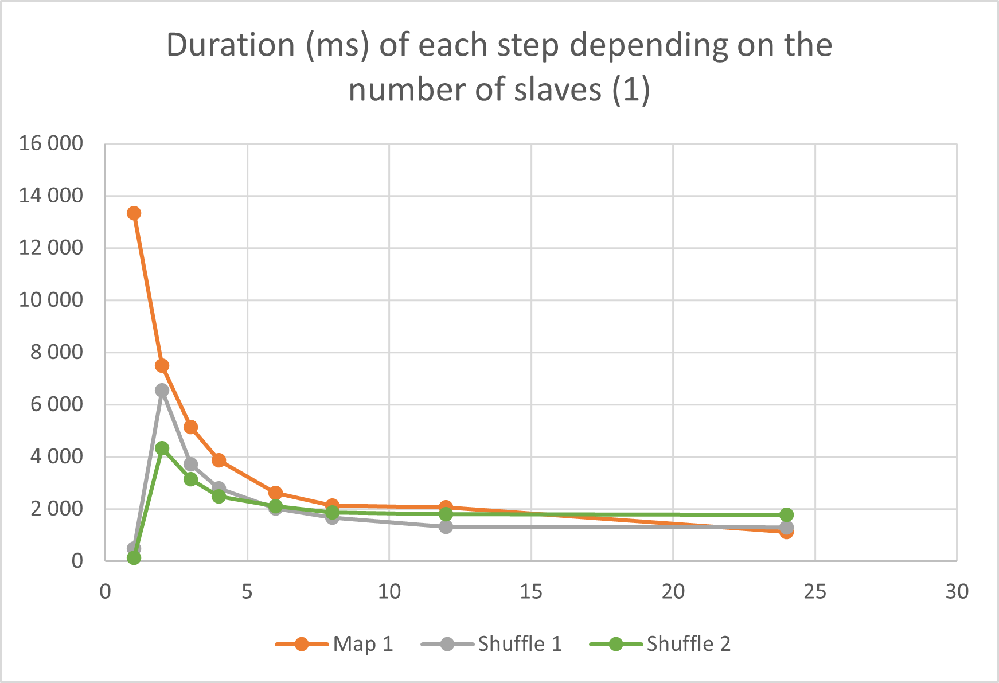
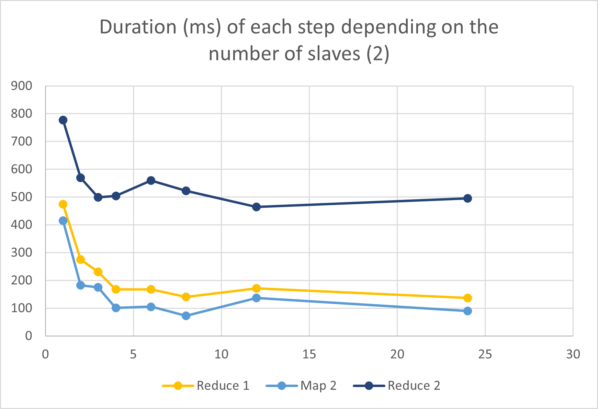
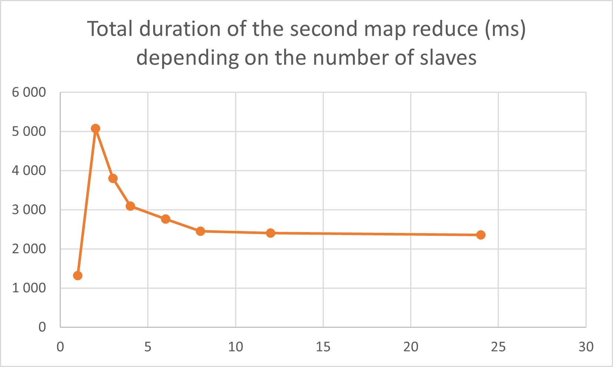

# SLR207 - MapReduce

## Sequential counter

A HashMap, especially `HashMap<String, Integer>` allows us to associate a number to a unique word. However, when we sort the results, we need a list to guarantee the order of the elements. It is faster than a TreeMap.

Here are the results that I had on the different files :

| File                         | Time to count (ms) | Time to sort (ms) | Total time (ms) | 5 most frequent words            |
|------------------------------|--------------------|-------------------|-----------------|----------------------------------|
| forestier_mayotte            | 3                  | 1                 | 4               | de - bien - ou - forestier - des |
| deontologie_police_nationale | 10                 | 2                 | 12              | de - la - police - et - des      |
| domaine_public_fluvial       | 22                 | 4                 | 26              | de - le - du - la - et           |
| sante_publique               | 946                | 55                | 1001            | de - la - des - les - et         |
| common_crawl                 | 10996              | 4260              | 15256           | the - to - end - of - de         |

## MapReduce

Here are the results for the first part (MapReduce to count the occurences), on 3 workers and on files of the directory `/cal/commoncrawl` ending with 00070, 00071 and 00072.

* Load the splits : 3336ms
* Map : 15373ms
* Shuffle : 9696ms
* Reduce : 588ms

## DEPLOY

There are 3 bash scripts in the folder `DEPLOY` which can only be executed from the root folder :
- `config.sh` : all the variables needed, such as the paths and the names of the machines
- `deploy.sh` : clean and deploy the slaves and then master
- `log.sh` : gather the log files from the remote machines into one (but keeping the individual files)

## 2nd MAP REDUCE

1. Map : transform the maps with words as keys and their occurences as values into a new map where the keys are the occurences and the values are the list of words with this occurence.
2. Shuffle :
    - each of the slaves sends to master its minimum and maximum occurence
    - after collecting all the responses, the master send the global minimum _a_ and maximum _b_
    - given the number of slaves _n_, the slave _m_ is responsible for the _m_-th range of _(b-a)/n_ elements between _a_ and _b_
    - each slave send their entries to the responsible machine
3. Reduce : sort the values received and reduce them (concatenate lists for the same occurence)

### Results and comparison with Amdahl's law

We performed the tests on three files from `cal/commoncrawl` (those ending with 00001, 00002 and 00073) to repeat the experiment 3 times.
The files were splited in 24 to be processed by 1, 2, 4, 6, 8, 12 or 24 slaves. We indicate the average results that we obtained in the following figures (two to ensure readability due to the different duration scales).

We observe that globally, the more slaves there are, the faster the algorithm is, except for the shuffle part for which the results with one slave are better than with two slaves.

At first glance, it can be surprising but it shouldn't be, because the shuffle part is the step during which the machines exchange the data. Thus, in the way we implement the map reduce, with one slave, all the time to create the threads that are listening or sending data and the time for data to be spread through the sockets, is saved. Since the exchange of information through the network is much more time-consuming then the actual data processing, the time saved by the lack of communication balances the time wasted to not parallelize the task.

We can also notice that the rise in performance with a higher number of slaves decreases with the latter, such that between 12 and 24 slaves, the speedup isn't so relevant. To look at this phenomena, we show the total duration of each map reduce and both depending on the number of slaves.

The experiment perfectly coroborates the **Amdahl's law** which says that even though ... , "the overall performance improvement gained by optimizing a single part of a system is limited by the fraction of time that the improved part is actually used" (see [Wikipedia page](https://en.wikipedia.org/wiki/Amdahl%27s_law)). Formally, the speedup in latency for a fixed workload is 1/(1-p+p/n) where p is the portion of the code that can be parallelized and n the number of processes, and therefore is limited by 1/(1-p). We can compare the results we had with Amdahl's law for p = 0.8.

We obtain the same trend.

## TODO

- Get rid of the system.exit(1) and terminate correctly
- Use SortedMap as soon as the shuffle step
- Compare efficiency
- Other files (see the linebreaks)

