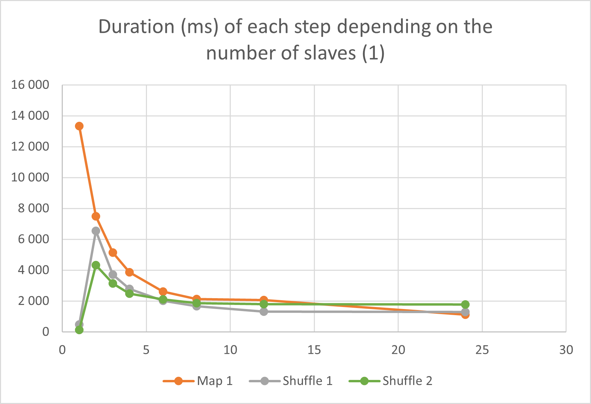
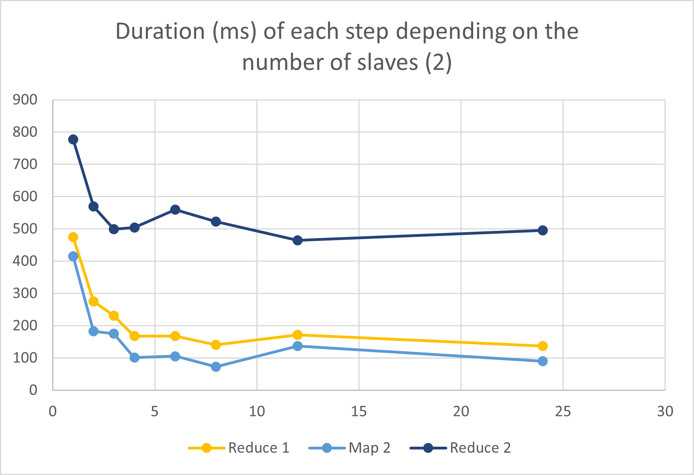
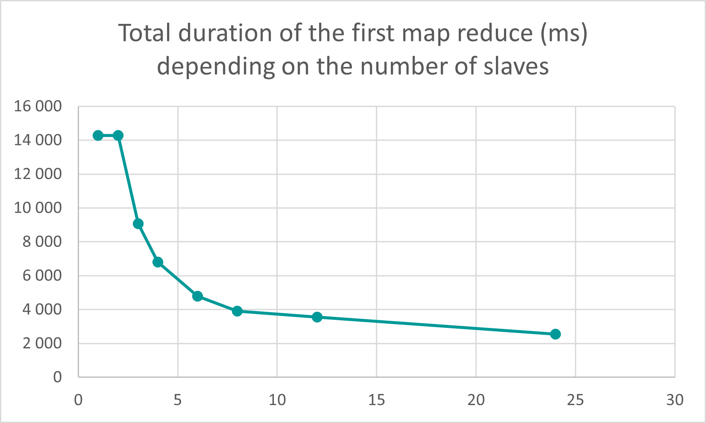
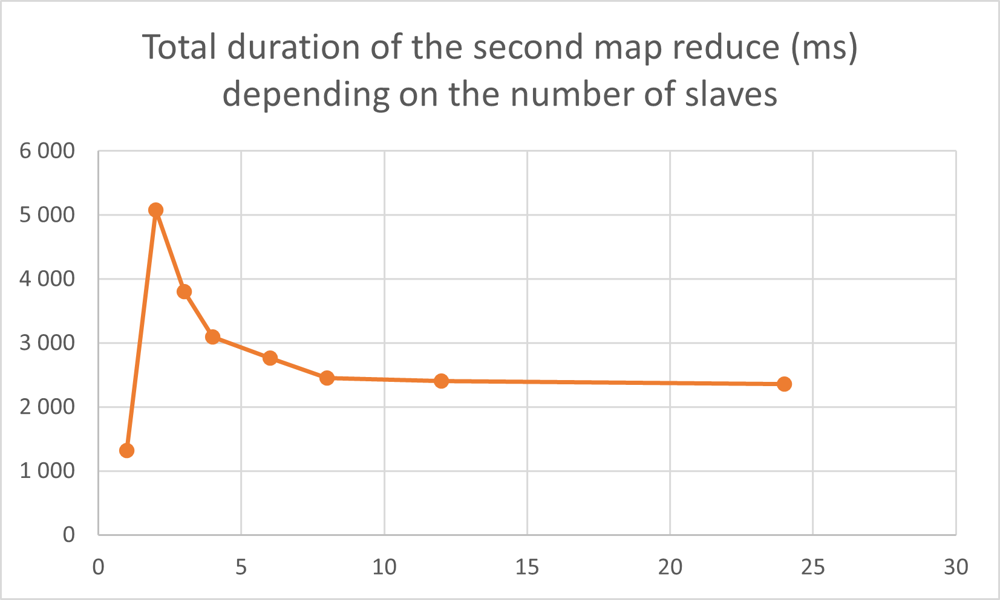
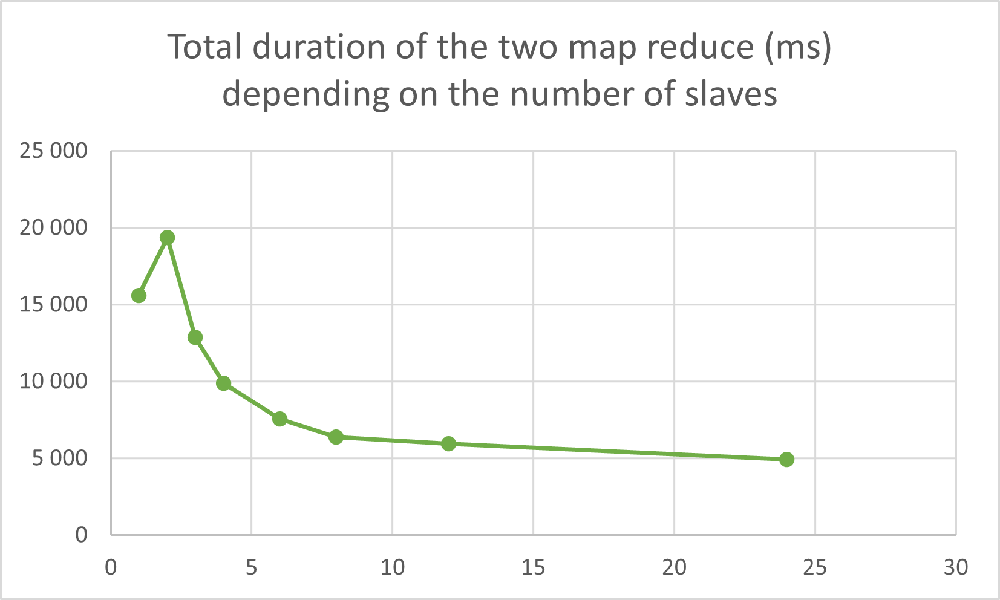
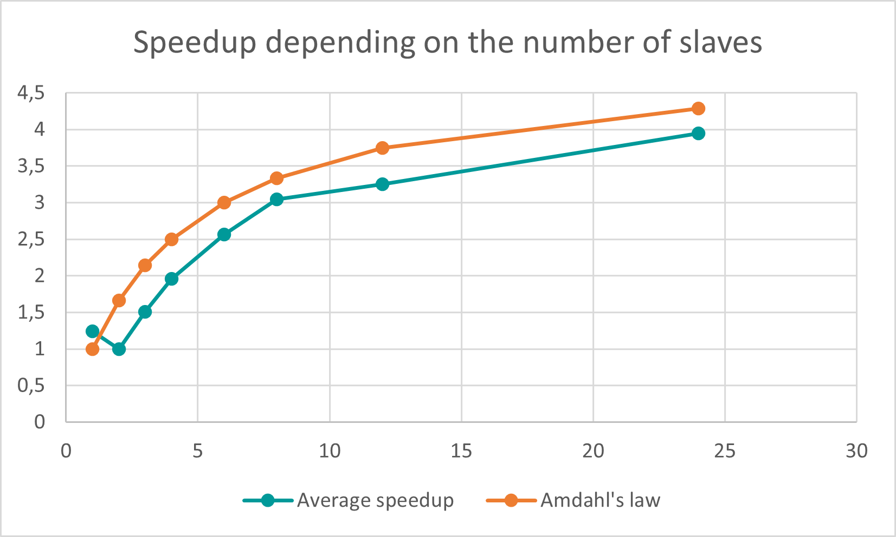

# SLR207 - MapReduce

## Sequential counter

A HashMap, especially `HashMap<String, Integer>` allows us to associate a number to a unique word. However, when we sort the results, we need a list to guarantee the order of the elements. It is faster than a TreeMap.

Here are the results that I had on the different files :

| File                         | Time to count (ms) | Time to sort (ms) | Total time (ms) | 5 most frequent words            |
|------------------------------|--------------------|-------------------|-----------------|----------------------------------|
| forestier_mayotte            | 3                  | 1                 | 4               | de - bien - ou - forestier - des |
| deontologie_police_nationale | 10                 | 2                 | 12              | de - la - police - et - des      |
| domaine_public_fluvial       | 22                 | 4                 | 26              | de - le - du - la - et           |
| sante_publique               | 946                | 55                | 1001            | de - la - des - les - et         |
| common_crawl                 | 10996              | 4260              | 15256           | the - to - end - of - de         |

### Implementation

#### General

To parallelize the process of counting words and sort them, we used a distributed map reduce twice : once for counting the occurences and once for sorting the results by occurences. They rely on the same principles : files or parts of a file are distributed among slaves, which do 3 steps then - map, shuffle and reduce -, while they send information to master, which is responsible to coordinate them, namely launch each step when all teh slaves have finished the previous one.

At the beginning, slaves are launched first (either manually or with the script) an then the master (_make sure that the time between the launches is sufficient for the slaves to create the servers_, otherwise you will get a "connection refused" exception). The master launches the slaves, which have recognized themselves thanks to the list of computers' names given as a parameter (their identifier is their number in this list). The slaves starts to retrieve the portion that they are attributed to, thanks to their id and the prefix given as a parameter. Finally, after the master collects all the responses indicating the end of the file loading, it sends a message to slaves to start the map reduce process.

To achieve this, master and slaves comunicate through __sockets__. Generic classes of client and server can be found in `src/Client.java` and `src/Server.java`, to read in the `ObjectInputStream` and write to the `ObjectOutputStream`. If we denote by _n_ the number of slaves, master plays the role of client for _n_ servers which are at the addresses from the list of computers and on _n_ ports which are the addition of a default port and the id. To communicate with master, each of the _n_ slaves have therefore one server with the port corresponding to their id. They have additionnally _n - 1_ clients and servers, which are handled by threads to use them in parallel. Note that the sockets are opened at the beginning and that threads are created later in the program each time the slave has to wait for or to send a message. To send the data, a client is used and to receive data, a server is used. The port to communicate with one slave corresponds to its id. It would allow to more easily track the errors. Please, notice that in our implementation, in the shuffle part, when a packet is for the slave which has it, it doesn't send it to itself but keeps it to add it to the other received packets from other slaves.

#### First Map Reduce

1. __Map__ : count the occurences of each word using the split method to retrieve each word separated and a hashmap.
2. __Shuffle__ : send and collect hashmaps built on the previous one but with only the words that a machine is responsible for, here the words whose the rest of the hashcode is the id of the machine modulo the number of slaves.
3. __Reduce__ : build one hashmap from all hashmaps received and the one that the slave was responsible for, by adding the occurences for a same word.

#### Second Map Reduce

1. __Map__ : transform the maps with words as keys and their occurences as values into a new map where the keys are the occurences and the values are the list of words with this occurence.
2. __Shuffle__ :
    - each of the slaves sends to master its minimum and maximum occurence
    - after collecting all the responses, the master send the global minimum _a_ and maximum _b_
    - given the number of slaves _n_, the slave _m_ is responsible for the _m_-th range of _(b-a)/n_ elements between _a_ and _b_
    - each slave send their entries to the responsible machines
3. __Reduce__ : sort the values received and reduce them (concatenate lists for the same occurence). Each of the slaves writes its results in a file. You can gather them on the computer where you launch the program with the script `DEPLOY/result.sh` (the only argument needed is the number of slaves).

### Results and comparison with Amdahl's law

We performed the tests on three files from `cal/commoncrawl` (those ending with 00001, 00002 and 00073) to repeat the experiment 3 times.
The files were splited in 24 to be processed by 1, 2, 4, 6, 8, 12 or 24 slaves. We indicate the average results that we obtained in the following figures (two to ensure readability due to the different duration scales).

We observe that globally, the more slaves there are, the faster the algorithm is, except for the shuffle part for which the results with one slave are better than with two slaves.

At first glance, it can be surprising but it shouldn't be, because the shuffle part is the step during which the machines exchange the data. Thus, in the way we implement the map reduce, with one slave, all the time to create the threads that are listening or sending data and the time for data to be spread through the sockets, is saved. Since the exchange of information through the network is much more time-consuming then the actual data processing, the time saved by the lack of communication balances the time wasted to not parallelize the task.

We can also notice that the rise in performance with a higher number of slaves decreases with the latter, such that between 12 and 24 slaves, the speedup isn't so relevant. To look at this phenomena, we show the total duration of each map reduce and both depending on the number of slaves.

The experiment perfectly coroborates the **Amdahl's law** which says that even though a higher number of processes leads to better performance, "the overall performance improvement gained by optimizing a single part of a system is limited by the fraction of time that the improved part is actually used" (see the [Wikipedia page](https://en.wikipedia.org/wiki/Amdahl%27s_law)). Formally, the speedup in latency for a fixed workload is $1/(1-p+p/n)$ where p is the portion of the code that can be parallelized and n the number of processes, and therefore is limited by $1/(1-p)$. We can compare the results we had with Amdahl's law for $p = 0.8$.

We computed the speedup by dividing the maximum total duration among the experiments with different numbers of slaves (here, it corresponds to two slaves), by the duration of each experiment. We obtain the same trend. However there is just a little gap between the curves, surely due to the fact that the highest duration corresponds to the second experiment for two slaves instead of the first one with one slave.
